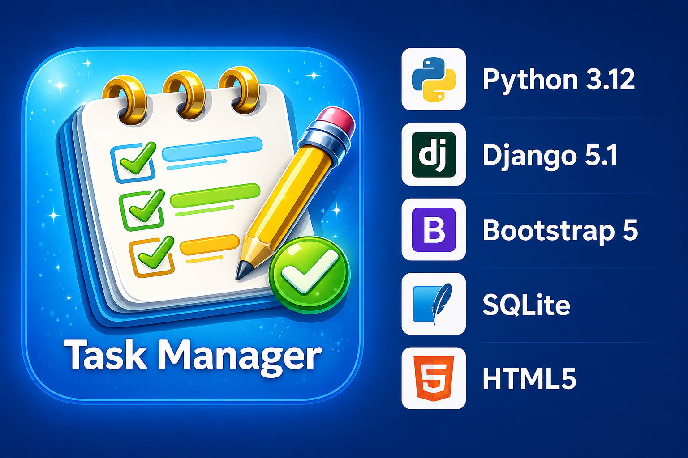

**Task Manager**

A simple Django-based Task Manager application with CRUD functionality, Bootstrap styling, and a customized Django admin panel.

---

# 🚀 Features

- ➕ Create new tasks
- 📖 View task details
- ✏️ Update existing tasks
- ❌ Delete tasks
- 🟢 Task completion status indicator
- 🎨 Bootstrap-styled forms and pages
- 🛠 Customized Django Admin Panel
- 🔍 Search tasks in admin panel
- 📂 Filter tasks by status and creation date
- ⚡ Bulk admin actions for task completion
- 👁 Read-only creation date in admin
- 📋 Pagination in admin panel
- 🎯 Custom admin field: long-standing tasks
- 🖼 Custom favicons for pages and admin panel

---

# 📁 Project Structure

```
Task-Manager/
│
├── src/
│   │
│   ├── app_taskmanager/                    
│   │   │
│   │   ├── migrations/                    
│   │   │
│   │   ├── templates/                      
│   │   │   └── app_taskmanager/
│   │   │       ├── task_list.html            # Page with all tasks
│   │   │       ├── task_detail.html          # Detailed task page
│   │   │       ├── task_form.html            # Create/update task form
│   │   │       └── task_confirm_delete.html  # Delete confirmation page
│   │   │
│   │   ├── admin.py                          # Django admin customization
│   │   ├── forms.py                          # Django forms
│   │   ├── models.py                         # Database models
│   │   ├── urls.py                           # Application routes
│   │   └── views.py                          # Application views 
│   │
│   ├── config/                            
│   │   ├── settings.py                       # Main Django settings
│   │   └── urls.py                           # Main URL configuration
│   │
│   ├── static/                             
│   │   └── images/
│   │       └── admin_favicon.png             # Custom admin favicon
│   │
│   ├── templates/                            # Global templates
│   │   └── admin/
│   │       └── base_site.html                # Customized Django admin template
│   │
│   ├── manage.py                             # Django management script
│   ├── db.sqlite3                          
│   └── seed_tasks.py                         # Script for database seeding
│
├── README.md                                 # Project documentation
└── requirements.txt                                
```

---

# 🧠 Model

```
class Task(models.Model):
    title = models.CharField(max_length=200)
    description = models.TextField(blank=True)
    is_completed = models.BooleanField(default=False)
    created_at = models.DateTimeField(auto_now_add=True)
```
---

# 🖥 Pages

| Page                  | Description                     |
| --------------------- | ------------------------------- |
| 📋 Task List          | Displays all tasks              |
| 📖 Task Details       | Shows detailed task information |
| ✏️ Task Form          | Create and update tasks         |
| ❌ Delete Confirmation | Confirm task deletion           |

---

# 🛠 Django Admin Customization

The admin panel includes:
- ✅ list_display
- ✅ list_filter
- ✅ search_fields
- ✅ list_editable
- ✅ readonly_fields
- ✅ fieldsets
- ✅ custom admin actions
- ✅ custom boolean field
- ✅ pagination
- ✅ custom admin titles
- ✅ custom admin favicon

---

# ⚙️ Installation

## 1️⃣ Clone repository
```commandline
git clone git@github.com:Olli4ka/Task-Manager.git
cd Task-Manager
```
## 2️⃣ Create virtual environment
```commandline
python -m venv .venv
```
**Activate environment:**
Windows
```commandline
.venv\Scripts\activate
```
Linux / MacOS
```commandline
source .venv/bin/activate
```
## 3️⃣ Install dependencies
```commandline
pip install -r requirements.txt
```
## 4️⃣ Apply migrations
```commandline
cd src
python manage.py makemigrations
python manage.py migrate
```
## 5️⃣ Run server
```commandline
python manage.py runserver
```
## 6️⃣ Seed the database (optional)
```commandline
python seed_tasks.py
```
## 🔑 Create Superuser
```commandline
python manage.py createsuperuser
```

---

# 🌐 URLs
| URL                 | Description        |
|---------------------| ------------------ |
| `/`                 | Task list          |
| `/create/`          | Create task        |
| `/update/<int:pk>/` | Update task        |
| `/delete/<int:pk>/` | Delete task        |
| `/view/<int:pk>/`   | Task details       |
| `/admin/`           | Django admin panel |

---

# 📸 UI Highlights

- 📋 Different favicons for each page
- 🟢 Green indicator for completed tasks
- 🔴 Red indicator for incomplete tasks
- 🎨 Bootstrap-styled buttons and forms

---

# 👩‍💻 Author

Created as a Django learning project for practicing:

- Django Models
- Forms
- CRUD operations
- Class-Based Views
- Django Admin customization
- Bootstrap integration
- Template rendering
- Static files
- Migrations and Git workflow

---
